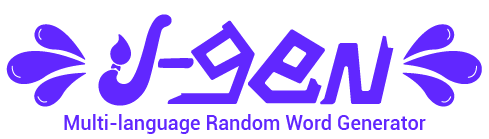

  

# I-GEN 🎨

## Features 🚀

- 📦 Small size
- ♿ Accessible
- 🟣 Simple Design
- ⏰ Countdown/timer
- 🎹 Keybinds/shortcuts
- 🌎 Multi-language support
- 🔊 Text-to-Speech support (TTS)
- 📱 Progressive Web Application (PWA)
- 🔃 Swap and combine different languages

## Why I-GEN?

I-GEN (a combination of the word "idea" and "generator") is an open-source application designed to help artists improve their skills by providing them with a diverse set of words to practice with.

The main focus of this project is not reinventing the wheel. Instead, I-GEN aims to address the common issues you may face while surfing the web in search of a tool like this one, such as:

- A limited set of words
- Weird shenanigans just to get two words
- Can not combine two languages simultaneously
- Have to visit or refresh a page just to get new words
- Most of the tools available are focused in one language (English mostly)

## Contributing

If you have an idea for a new feature or have found a bug, please open an issue.

Oh wait... do you feel like contributing today? That's awesome! We have a [Contributing Guide](/CONTRIBUTING.md) to help guide you through this journey.

(**Just looking to contribute to translations?** Jump [right here 🡥](/CONTRIBUTING.md#translation-contributions))

## License

I-GEN is licensed under the MIT license (MIT). But as this project employs content extracted using [Wiktextract](https://github.com/tatuylonen/wiktextract) and [kaikki-adj-noun-parser](https://github.com/ZEBAS204/kaikki-adj-noun-parser) from the [Wikimedia Foundation](https://www.wikimedia.org), may differ on licenses. See the [LICENSE](/LICENSE) file for more details.

## Attributions

**Terminology:** The set of two files containing words, in this case, adjectives and nouns from a given language are called "wordsets".

Some old versions of this application used English wordsets that were extracted from [WordNet's Electronic Lexical Database](https://wordnet.princeton.edu):

> George A. Miller (1995). WordNet: A Lexical Database for English.
> Communications of the ACM Vol. 38, No. 11: 39-41.
> Christiane Fellbaum (1998, ed.) WordNet: An Electronic Lexical Database. Cambridge, MA: MIT Press.

## Previous versions

To this date, previous versions made before the release are still usable to anyone. The main idea of keeping these previous versions is to show progress and improvements over them, as this project was originally made to learn React.

If you wish to see by yourself any of these previous versions, please refer to their following branches BUT, expect issues, unresponsiveness, performance problems, visual glitches, incomplete features, no words nor translations, and bugs:

- [V1 branch](/tree/v1) -> [V1 APP](https://i-gen-v1.vercel.app/)
- [V2 branch](/tree/v2) -> [V2 APP](https://i-gen-v2.vercel.app/)
- The V3 branch is currently the `master` branch

---

## One-Click Deploy

With just one click, you can deploy your own copy of this application using [Vercel](https://vercel.com). Simply click the "Deploy" button below, and Vercel will automatically create a new instance of the application, ready for you to customize and use however you like.

